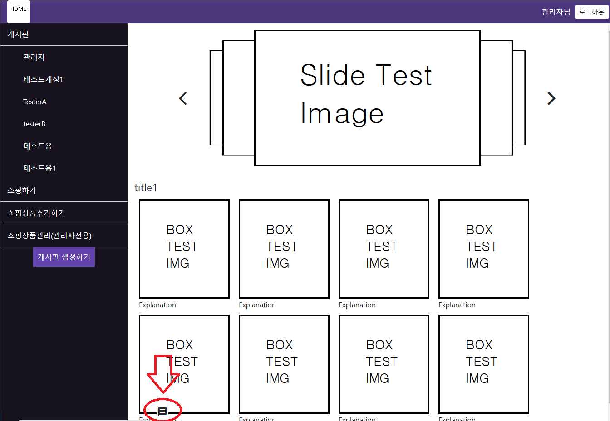

# 포트폴리오
웹 사이트에서 쉽게 볼 수 있는 로그인, 게시판, 채팅 등등 기본적인 기능을 구현해놓은 포트폴리오입니다.
# 사용된 기술
## ClientSide
* AngularJs
* Html
* Css
* Javscript
## ServerSide
* Nodejs
* Express
* SocketIO
## DB
* Firebase
# 테스트 방법
## **접속하기**
* https://myproject0015.herokuapp.com 에 접속 합니다.
## **로그인**
* 회원 가입과 로그인을 할 수 있습니다
* 어드민 계정은 id:admin , pw:123456789 입니다.
## **게시판**
* 로그인 후 게시판을 생성할 수 있습니다.
* 글과 댓글을 작성해볼 수 있습니다.
## **쇼핑**
* 쇼핑하기
    * 로그인 후 이용할 수 있습니다.
    * 상품을 담고 간단한 쇼핑 체험을 해볼 수 있습니다.
    * 실제로 결제는 되지 않습니다.
* 쇼핑상품추가하기
    * 쇼핑하기에서 보이는 쇼핑 상품을 추가할 수 있습니다.
* 쇼핑상품관리(관리자전용)
    * 어드민 계정으로 로그인 시 쇼핑 아이템 삭제 또는 쇼핑 태그 추가 삭제를 할 수 있습니다.
## **채팅**

* 좌측 하단 메뉴 탭 클릭 시 채팅창이 열리게 됩니다.
* 현재 사이트에 가입되어있는 모든 유저를 보여주게 됩니다.
* 채팅 하고 싶은 유저가 로그인 되어있어야 채팅이 가능합니다.

